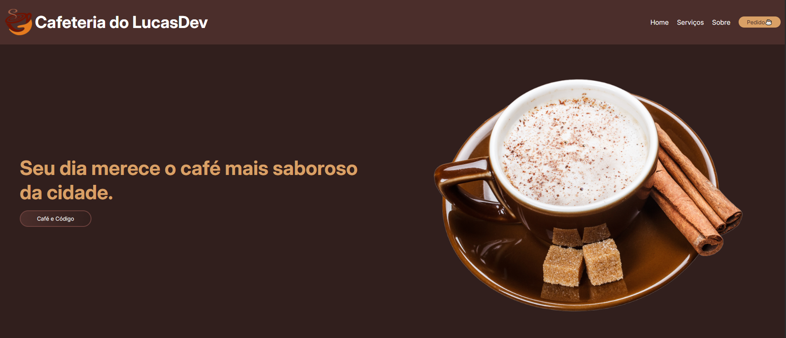
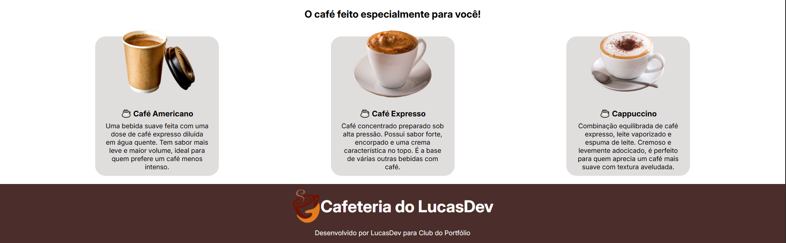
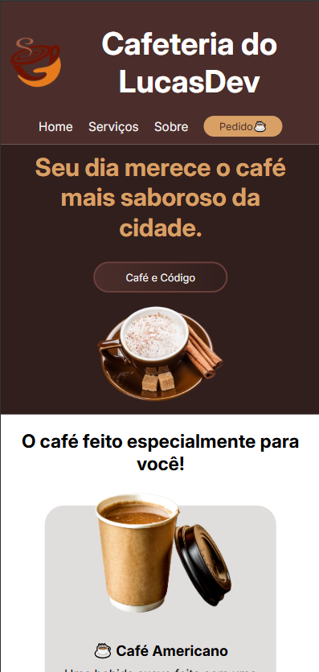
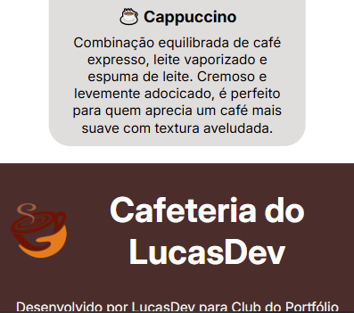
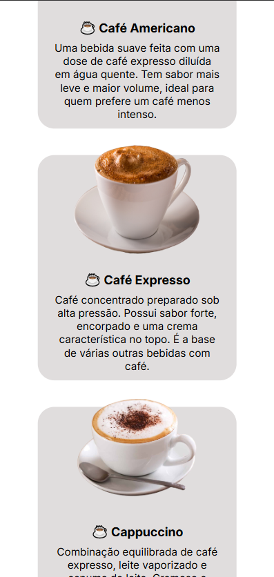

# ☕ Projeto Cafeteria Simples

Este é um projeto de site simples para uma **cafeteria**, exibindo alguns cafés especiais e informações básicas do local. O objetivo é apresentar um layout moderno e responsivo, que funcione bem em **desktops e dispositivos móveis**.

## 💻 Tecnologias Utilizadas

- HTML5
- CSS3
- JavaScript (opcional)
- Responsividade com media queries

## 📸 Imagens do Projeto

### Versão Desktop




### Versão Mobile





> As imagens acima mostram a interface responsiva do site em diferentes tamanhos de tela.

## 🧩 Funcionalidades

- Página inicial com destaque para cafés em exposição
- Layout 100% responsivo
- Design minimalista e elegante

## 🚀 Como executar o projeto

1. Clone o repositório:
```bash
git clone https://github.com/seu-usuario/nome-do-repositorio.git
